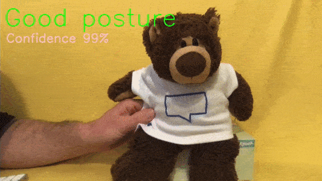
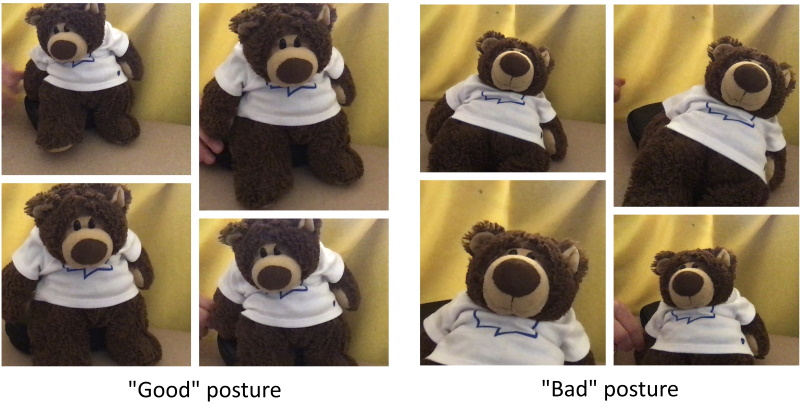
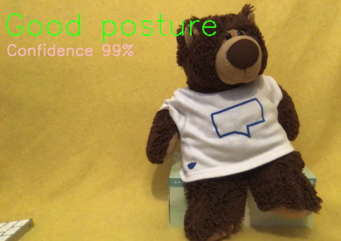

# Home office ergonomics

Monitor good posture - with machine learning. Ensure proper office ergonomics with Tensorflow, a webcam and OpenCV Python real-time computer vision libraries




If you sit behind a desk for hours at a time, you're possibly going to slump. This may result in neck and back pain. This can be avoided by teaching a machine to recognise "good" posture from "bad" posture.  To encourage better posture, instant feedback with a quick sound everytime poor office ergonomics are observed.  Model training and monitoring is handled locally on device. 


## How does this work?

Machine learning packages available for Python 3

- [Scikit-learn](https://scikit-learn.org) - open source Python machine learning library supporting supervised learning & weightings
- [Tensorflow Keras](https://www.tensorflow.org/guide/keras/overview) - high-level API to build and train models 
- [OpenCV](https://opencv.org/) - library of programming functions for real-time computer vision


## Setup
These instructions have been tested on a Mac, and a Raspberry Pi [Raspberry Pi 4 Instructions](./raspberry-pi/raspberry-pi.md). 


Ensure Python 3, `virtualenv` and `pip` are insatlled.

```
which python3

virtualenv -p `which python3` venv
source venv/bin/activate
python --version
pip --version
pip install -r requirements.txt 
```


## Training



Firstly we need to capture photos of "good posture" and "slumped posture". These images are required as input to train supervised learning algoritm. In capture mode a sample image is captured every second and saved in a training folder.  Run the capture mode whilst moving a bit in space to give a variety amongst the images. Press the "space" bar (with the preview frame in focus) to stop capture after about 30 images (30 secomds) have been captured. 

Note: the first run may take a few minutes to start


```
# Capture samples of "good" posture
python posture-watch.py --capture-good

# Capture samples of "bad" posture
python posture-watch.py --capture-slump
```

## Train
Now we have a variety of images represnting both "good" and "bad" postures let us train a model. This should only take a few minutes. The more images captured will takle longer to train, but should be more accurate.

```
python posture-watch.py --train
```


## Live Video

With the model trained we can test the classification by running a live video feed from the webcam into the model. The classification and predication confidence is overlaind onto the image. Press the "space" bar (with the preview frame in focus) to stop.



```
python posture-watch.py --live
```

## Live Video with Sound

If you are satisifed with the accuracy of the predictions, you can constantly run the model and issue a sound alert everytime poor posture is detected. 

```
python posture-watch.py --live --sound
```


## Cleanup

```
rm -fr train/
```

